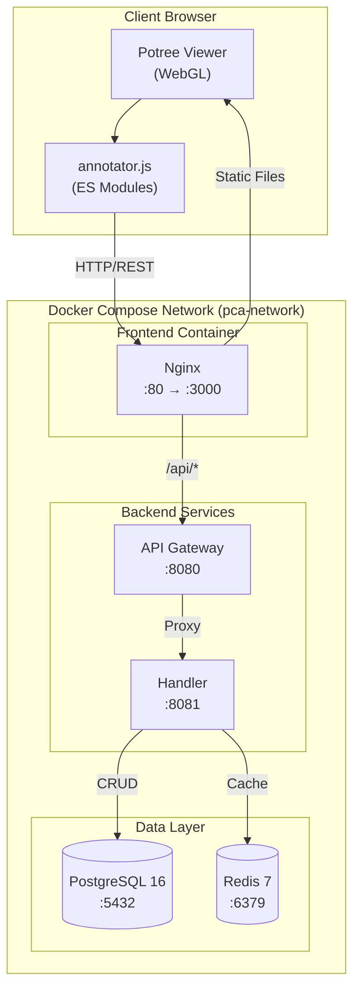
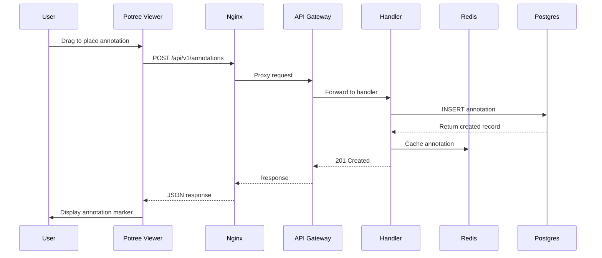
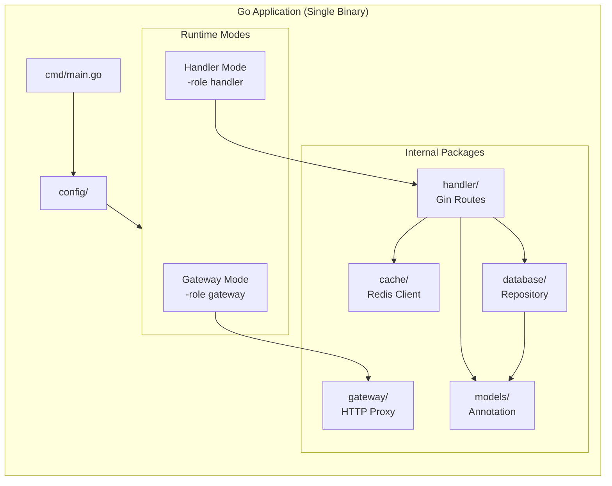
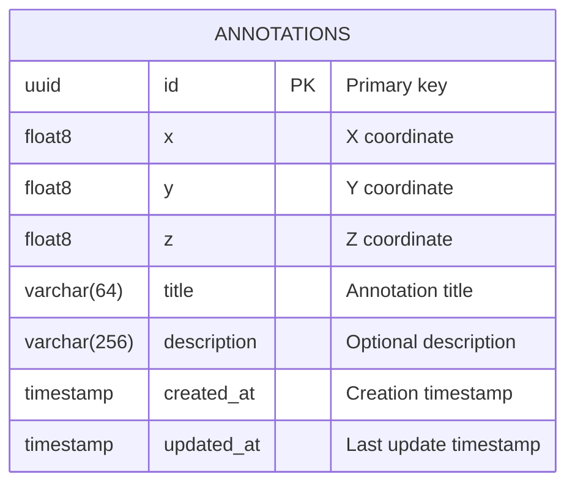

# Point Cloud Annotator


A web application for loading, viewing, and annotating 3D point clouds with persistent storage.

## Features

- **3D Point Cloud Visualization**: Built on Potree WebGL viewer for efficient rendering of large point cloud datasets
- **Interactive Annotations**: Drag on the point cloud to place annotation markers using Potree's built-in annotation tool
- **Persistent Storage**: Annotations are saved to PostgreSQL with Redis caching for optimal performance
- **Delete Functionality**: Easily remove annotations with a hover-to-reveal delete button
- **Microservices Architecture**: API Gateway and Handler services with role-based configuration

## Architecture

### System Overview



### Request Flow



### Component Architecture



### Data Model



### Backend Services

The backend is a **single Go binary** that runs in different modes based on the `-role` flag:

| Mode    | Flag            | Port | Description                                                  |
| ------- | --------------- | ---- | ------------------------------------------------------------ |
| Gateway | `-role gateway` | 8080 | HTTP reverse proxy that routes requests to handler services  |
| Handler | `-role handler` | 8081 | Processes annotation CRUD operations with database and cache |

**Technology Stack:**

| Component            | Technology                                    | Purpose                                          |
| -------------------- | --------------------------------------------- | ------------------------------------------------ |
| Dependency Injection | [Uber Fx](https://github.com/uber-go/fx)      | Lifecycle management, modular architecture       |
| HTTP Framework       | [Gin](https://github.com/gin-gonic/gin)       | Fast HTTP routing and middleware                 |
| Database Driver      | [pgx](https://github.com/jackc/pgx)           | Native PostgreSQL driver with connection pooling |
| Cache Client         | [go-redis](https://github.com/redis/go-redis) | Redis client with automatic reconnection         |
| Logging              | [Zap](https://github.com/uber-go/zap)         | Structured, leveled logging                      |

### Frontend

The frontend is served by Nginx and consists of:

| Component    | File                | Description                                               |
| ------------ | ------------------- | --------------------------------------------------------- |
| HTML         | `index.html`        | Main page with Potree container and annotation UI         |
| JavaScript   | `js/annotator.js`   | ES module handling annotation CRUD and Potree integration |
| CSS          | `css/annotator.css` | Custom styles for annotation toolbar and dialogs          |
| Nginx Config | `nginx.conf`        | Reverse proxy for API, static file serving, path rewrites |

**Key Frontend Features:**

- Uses Potree's built-in `annotationTool.startInsertion()` for precise point placement
- ES Modules with THREE.js for 3D coordinate handling
- Real-time status updates and error handling
- Annotations include camera position for consistent viewing angles

## Quick Start

### Using Docker Compose (Recommended)

```bash
# Start all services
make docker-up

# Or directly with docker compose
docker compose up -d
```

Access the application:

- **Frontend**: http://localhost:3000
- **API Gateway**: http://localhost:8080

### Local Development

```bash
# Install Go dependencies
make deps

# Build the binary
make build

# Run tests
make test

# Start PostgreSQL and Redis locally, then:
make run-handler  # In terminal 1
make run-gateway  # In terminal 2
```

## API Endpoints

All endpoints are prefixed with `/api/v1`

| Method | Endpoint           | Description           |
| ------ | ------------------ | --------------------- |
| GET    | `/annotations`     | List all annotations  |
| GET    | `/annotations/:id` | Get annotation by ID  |
| POST   | `/annotations`     | Create new annotation |
| PUT    | `/annotations/:id` | Update annotation     |
| DELETE | `/annotations/:id` | Delete annotation     |

### Request/Response Examples

**Create Annotation**

```json
POST /api/v1/annotations
{
  "x": 1.5,
  "y": 2.5,
  "z": 3.5,
  "title": "Point of Interest",
  "description": "Optional description (max 256 bytes)"
}
```

**Response**

```json
{
    "data": {
        "id": "uuid",
        "x": 1.5,
        "y": 2.5,
        "z": 3.5,
        "title": "Point of Interest",
        "description": "Optional description",
        "created_at": "2024-01-01T00:00:00Z",
        "updated_at": "2024-01-01T00:00:00Z"
    }
}
```

## Configuration

The service can be configured via environment variables or command-line flags:

| Variable       | Flag    | Default               | Description                                      |
| -------------- | ------- | --------------------- | ------------------------------------------------ |
| `SERVICE_ROLE` | `-role` | `gateway`             | Service role: `gateway` or `handler`             |
| `SERVER_PORT`  | `-port` | `8080`                | HTTP server port                                 |
| `HANDLER_URL`  | -       | `http://handler:8081` | Handler service URL (gateway mode only)          |
| `DATABASE_URL` | -       | `postgres://...`      | PostgreSQL connection string (handler mode only) |
| `REDIS_URL`    | -       | `redis://redis:6379`  | Redis connection string (handler mode only)      |
| `ENVIRONMENT`  | -       | `development`         | Environment: `development` or `production`       |

### Docker Compose Services

| Service    | Container      | Port            | Health Check     |
| ---------- | -------------- | --------------- | ---------------- |
| Frontend   | `pca-frontend` | 3000 → 80       | -                |
| Gateway    | `pca-gateway`  | 8080            | HTTP check       |
| Handler    | `pca-handler`  | 8081 (internal) | HTTP check       |
| PostgreSQL | `pca-postgres` | 5432            | `pg_isready`     |
| Redis      | `pca-redis`    | 6379            | `redis-cli ping` |

## How Annotations Work

1. **Adding an Annotation:**
    - Click the "Add Annotation" button in the toolbar
    - Drag on the point cloud to position the marker
    - Release to confirm placement
    - Fill in the title and optional description in the dialog
    - Click "Save" to persist to the database

2. **Viewing Annotations:**
    - Annotations load automatically on page load
    - Click on any annotation marker to expand it
    - Use the "Refresh" button to reload from the server

3. **Deleting Annotations:**
    - Hover over an annotation to reveal the delete button (×)
    - Click the delete button and confirm

## Project Structure

```
.
├── backend/
│   ├── cmd/
│   │   └── main.go              # Application entry point with Fx modules
│   ├── internal/
│   │   ├── cache/               # Redis cache implementation
│   │   │   └── cache.go         # Cache operations with TTL
│   │   ├── config/              # Configuration management
│   │   │   └── config.go        # Environment and flag parsing
│   │   ├── database/            # PostgreSQL repository
│   │   │   └── repository.go    # CRUD operations with auto-migration
│   │   ├── gateway/             # API Gateway proxy logic
│   │   │   └── gateway.go       # HTTP reverse proxy
│   │   ├── handler/             # Request handlers
│   │   │   └── handler.go       # Gin route handlers
│   │   └── models/              # Data models
│   │       └── annotation.go    # Annotation struct and validation
│   ├── Dockerfile               # Multi-stage Go build
│   ├── go.mod                   # Go module dependencies
│   └── go.sum                   # Dependency checksums
├── frontend/
│   ├── index.html               # Main HTML page with Potree container
│   ├── css/
│   │   └── annotator.css        # Toolbar, dialog, and annotation styles
│   ├── js/
│   │   └── annotator.js         # ES module: API client, Potree integration
│   └── nginx.conf               # Reverse proxy and path rewrite rules
├── .tmp/
│   └── potree/                  # Potree library (cloned from GitHub)
│       ├── build/               # Built Potree viewer
│       ├── libs/                # Dependencies (THREE.js, etc.)
│       ├── pointclouds/         # Sample point cloud data
│       └── resources/           # Icons, textures, translations
├── docker-compose.yml           # 5-service Docker Compose configuration
├── Makefile                     # Build, test, and Docker commands
└── README.md                    # This file
```

## Development

### Running Tests

```bash
# Run all tests
make test

# Run tests with coverage
make test-coverage
```

### Code Quality

```bash
# Lint code
make lint

# Format code
make fmt
```

### Docker Commands

```bash
# Build images
make docker-build

# Start services
make docker-up

# View logs
make docker-logs

# View specific service logs
make docker-logs-handler

# Stop services
make docker-down

# Clean up (including volumes)
make docker-clean
```

## Troubleshooting

### Common Issues

**Annotations not saving:**

- Check that all Docker services are healthy: `docker compose ps`
- View handler logs: `docker compose logs handler`
- Verify database connectivity: `docker compose exec postgres psql -U postgres -d annotations -c "SELECT count(*) FROM annotations;"`

**Point cloud not loading:**

- Ensure Potree is properly set up in `.tmp/potree/`
- Check browser console for 404 errors
- Verify nginx is serving files: `curl -I http://localhost:3000/potree/build/potree/potree.js`

**Icons/textures showing 404:**

- The nginx config uses path rewrites for Potree resources
- Restart frontend after config changes: `docker compose restart frontend`

**Handler showing unhealthy:**

- This can occur during startup while waiting for database
- Check handler logs: `docker compose logs handler`
- Verify database is ready: `docker compose logs postgres`

### Useful Commands

```bash
# Check service health
docker compose ps

# View all logs
docker compose logs -f

# Restart a specific service
docker compose restart frontend

# Access PostgreSQL directly
docker compose exec postgres psql -U postgres -d annotations

# Access Redis directly
docker compose exec redis redis-cli

# Rebuild and restart everything
docker compose down && docker compose up -d --build
```

## License

See [LICENSE](LICENSE) file.
